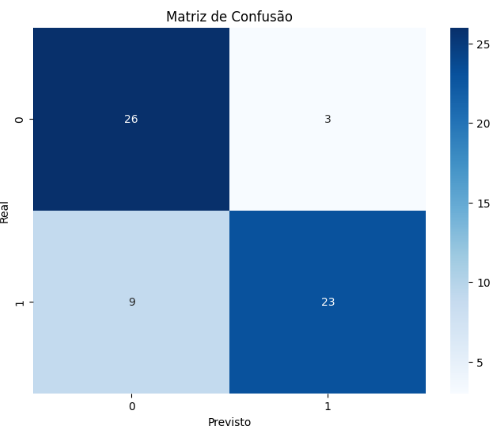
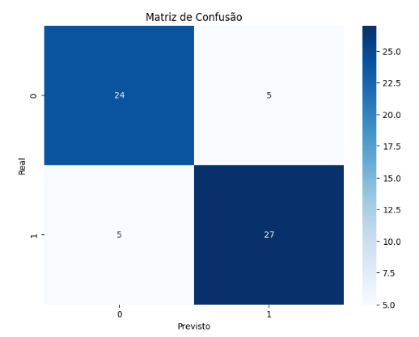

# Modelo de Classificação | Machine Learning

## Introdução

No meu projeto, utilizei um modelo de machine learning para identificar pacientes com doença cardíaca. A base de dados foi obtida do Kaggle e contém informações médicas de diversos pacientes. Após a preparação dos dados, apliquei o algoritmo Random Forest para realizar a classificação. Avaliei o desempenho do modelo utilizando métricas como acurácia, precisão e recall, alcançando resultados consistentes entre 82% e 83%. O objetivo do modelo é auxiliar na detecção precoce de doenças cardíacas, ajudando a identificar pacientes em risco com base nos seus atributos médicos.

**Detalhe immportante**
Supervised Learning (Aprendizado Supervisionado): O modelo está utilizando um algoritmo de aprendizado supervisionado, o que significa que ele aprende a partir de dados rotulados. A coluna **target** fornece os rótulos que informam ao modelo se um paciente tem ou não doenças cardíacas. Isso permite que ele aprenda a identificar padrões a partir das características dos pacientes.

Com isso, utilizei dois modelos para comparação, um primeiro básico onde ele usa como alvo apenas uma coluna que indica se há presença cardíaca ou não. E o segundo como um modelo com foco a partir de  sintomas.

Abaixo segue o dicionário de dados com as colunas  para explicação e entedimento.

Dicionário de Dados

- **age**: Idade do paciente.
- **sex**: Sexo do paciente (0 = feminino, 1 = masculino).
- **cp**: Tipo de dor no peito (0 a 3, onde cada número representa um tipo diferente de dor).
- **trestbps**: Pressão arterial em repouso (em mm Hg).
- **chol**: Nível de colesterol total em mg/dl.
- **fbs**: Nível de açúcar no sangue em jejum (0 = menor que 120 mg/dl, 1 = maior que 120 mg/dl).
- **restecg**: Resultados do eletrocardiograma em repouso (0, 1 ou 2).
- **thalach**: Frequência cardíaca máxima alcançada.
- **exang**: Angina induzida por exercício (0 = não, 1 = sim).
- **oldpeak**: Depressão do segmento ST induzida por exercício em relação ao repouso.
- **slope**: Inclinação do segmento ST durante o exercício (0, 1 ou 2).
- **ca**: Número de vasos sanguíneos coloridos (0 a 3).
- **thal**: Tipo de thalassemia (0, 1, 2 ou 3).
- **target**: Indicador da presença de doenças cardíacas (0 = não, 1 = sim).

## Metricas utilizadas

Acurácia 
Predição 
Retaill

Matriz de Confusão para visualização.

## Algoritmo utilizado

**Randon Forest**

O Random Forest é um algoritmo de machine learning que cria várias árvores de decisão a partir de dados aleatórios. A previsão final é feita pela média (em regressão) ou pela maioria dos votos (em classificação). Ele é eficiente, robusto contra overfitting e funciona bem com dados complexos.

--------

## Modelos Machine Learning </>

Utilizei dois modelos para comparação:  

O primeiro é um modelo básico, que considera apenas a coluna que indica a presença de doenças cardíacas.  
O segundo modelo, por sua vez, é focado em sintomas, incorporando características relacionadas aos sinais clínicos dos pacientes.

 
 Modelo básico 

## Desenvolvimento - Modelo 1 | Modelo básico

Neste projeto, utilizei técnicas de machine learning para desenvolver um modelo capaz de identificar a presença de doenças cardíacas em pacientes com base em dados médicos. O desenvolvimento seguiu os seguintes passos:

**Exploração e Análise dos Dados:**
A base de dados foi carregada e explorada para entender melhor suas características. Verifiquei a distribuição de valores, identifiquei possíveis valores ausentes e analisei a correlação entre os atributos.

**Pré-processamento dos Dados:**
Limpei e transformei os dados para garantir que o modelo recebesse entradas adequadas. Isso incluiu a divisão dos dados em conjuntos de treino e teste.
Com base na coluna de referência TARGET eu treinei o medelo removendo-a e deixando o restante para predição do meu ML.

**Modelo de Machine Learning:**
Utilizei o algoritmo Random Forest para realizar a classificação dos pacientes. O Random Forest é um método de aprendizado supervisionado que cria várias árvores de decisão e combina suas previsões para melhorar a precisão e reduzir o risco de overfitting.

**Treinamento e Avaliação:**
O modelo foi treinado usando os dados de treino e avaliado com métricas como acurácia, precisão e recall . Alcançamos resultados entre 82% e 83%, indicando um bom desempenho do modelo na identificação correta de pacientes com doenças cardíacas.

**Matriz de Confusão:**

**Arquivo:** Classfication_Model_1.ipynb

-------

 Modelo com Foco em Sintomas 

## Desenvolvimento - Modelo 2| Modelo com base em sintomas

Neste projeto, utilizei técnicas de machine learning para desenvolver um modelo capaz de identificar a presença de doenças cardíacas em pacientes com base em alguns sinotmas específicos, sendo eles: tipo de dor no peito, angina introduzida por execício, depressão por segmento, inclinação de segmento e tipo de thalassemia (proteina que identifica a proteina no sangue). O desenvolvimento seguiu os seguintes passos:

**Exploração e Análise dos Dados:**
A base de dados foi carregada e explorada para entender melhor suas características. Verifiquei a distribuição de valores, identifiquei possíveis valores ausentes e analisei a correlação entre os atributos.

**Pré-processamento dos Dados:**
Limpei e transformei os dados para garantir que o modelo recebesse entradas adequadas. Isso incluiu a divisão dos dados em conjuntos de treino e teste.
Com base na coluna de referência TARGET eu treinei o medelo removendo-a e selecionando algumas colunas especificas para a predição do meu ML.

**Modelo de Machine Learning:**
Utilizei o algoritmo Random Forest para realizar a classificação dos pacientes também, assim como o Modelo 1. O Random Forest é um método de aprendizado supervisionado que cria várias árvores de decisão e combina suas previsões para melhorar a precisão e reduzir o risco de overfitting.

**Treinamento e Avaliação:**
O modelo foi treinado usando os dados de treino e avaliado com métricas como acurácia, precisão e recall . Alcançamos resultados entre bons porém mais baixos que o modelo 1, indicando um bom desempenho do modelo na identificação.

**Matriz de Confusão:**

**Arquivo:** Classfication_Model_2.ipynb

  

----

# Conclusão

Utilizei dois modelos de machine learning na análise de dados para identificar pacientes com doenças cardíacas. Embora um maior percentual de acurácia indique um desempenho superior na identificação correta desses pacientes, é crucial considerar outras métricas, como precisão e recall, para uma avaliação mais abrangente. Após a análise, ficou claro que o modelo básico se destacou, apresentando resultados mais robustos e consistentes em comparação ao segundo modelo. Essa superioridade sugere que, mesmo com a complexidade adicional do segundo modelo, as características selecionadas no modelo básico conseguiram capturar de maneira eficaz os padrões presentes nos dados. Este resultado não apenas valida a eficácia do meu primeiro modelo, mas também ressalta a importância de uma escolha criteriosa das variáveis no processo de modelagem. Essa abordagem abrangente reforça a ideia de que a combinação de diferentes métricas é fundamental para avaliar a performance de modelos de machine learning em contextos clínicos.